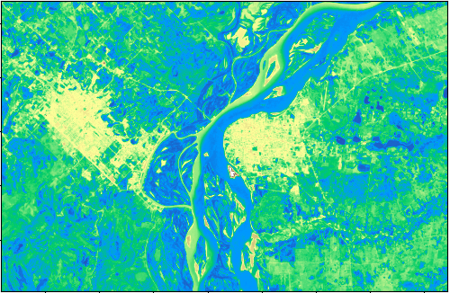
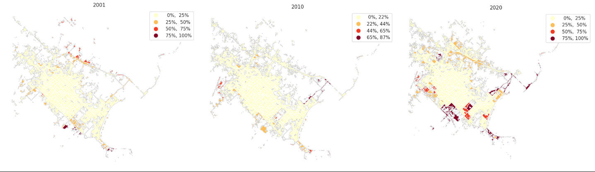
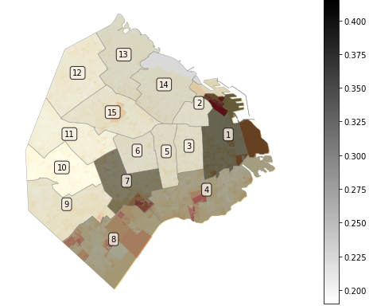
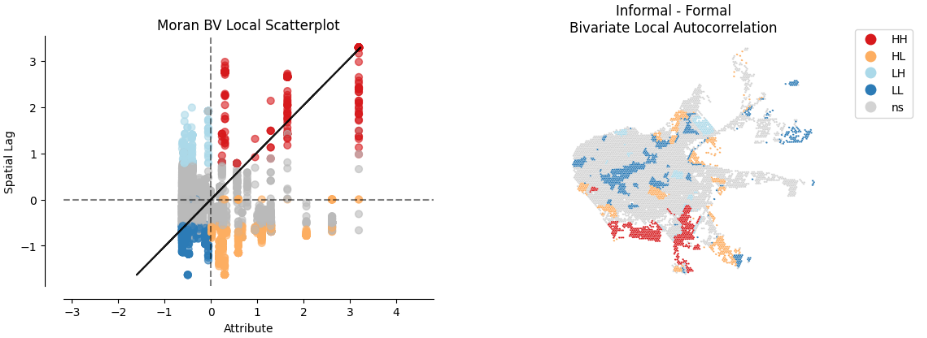

# `CENSAr` 
## Urban growth analysis tools

Combines vector and raster data to study the physical and qualitatuve growth of urban areas. 

**1. Urban extent detection**

Solve classification problems calculating Landsat or Sentinel imagery based indexes (e.g. `Urban Index (UI)`) 

(...) preliminar notebooks available on [raster data analysis](https://github.com/CEEU-lab/CENSAr/tree/develop/CENSAr/raster_data_analysis)

**2. Census Tract distributions**

Simulate tracts distributions based on observed census data (`2001`, `2010`, `2020`)

(...) modelling functions available on [spatial distributions](https://github.com/CEEU-lab/CENSAr/tree/develop/CENSAr/spatial_distributions)

**3. Spatial features**

Instatiate city objects and evaluate their spatial distribution of attributes

* Spatial Dissimilitude

(...) indexes calculation available on [spatial features](https://github.com/CEEU-lab/CENSAr/tree/develop/CENSAr/spatial_features)

**4. Spatial correlation**

Detect variable groups concentration

* Clustering

(...) clustering functions available on [clustering](https://github.com/CEEU-lab/CENSAr/tree/develop/CENSAr/clustering) 
