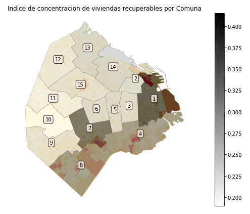

# CENSAr
Esquemas de análisis poblacional
> Este repositorio compila una serie de clases y métodos diseñados para descomponer un territorio urbano a partir de sus atributos censales. 

La Clase ´ContextoUrbano´ tiene por finalidad instanciar un tejido urbano y describirlo en función de sus atributos estructurales.
e.g.

**Segregación Urbana**

´´´tejido_urbano = construye_territorio(gdf = polygons, # unidad administrativa inferior con atributo a ser evaluado
                                     nombre_unidad_s = "COMUNA", # nombre de la unidad administrativa superior
                                     nombre_unidad_i = "link", # nombre de la unidad administrativa inferior,
                                     nombre_variable = "INMAT", # nombre de la variable a ser evaluada
                                     nombre_categoria = "Recuperables"  # nombre de la categoría cuya distribución espacial se quiere verificar
                                     )´´´

