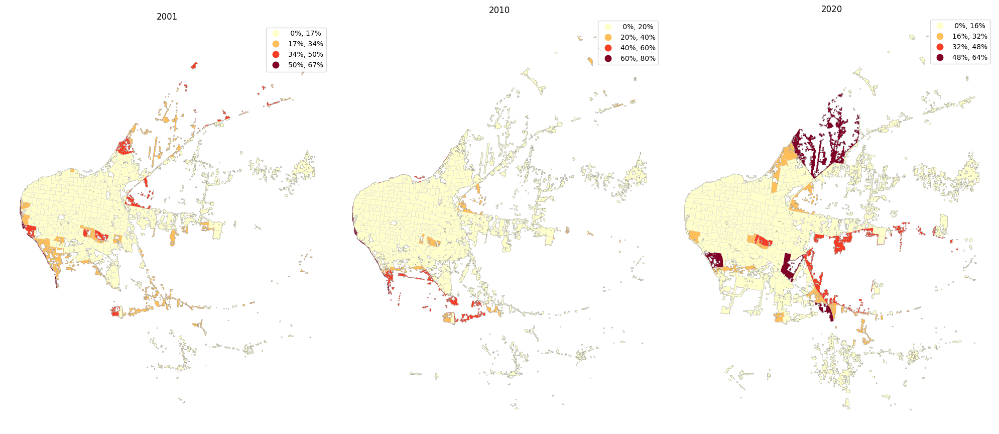
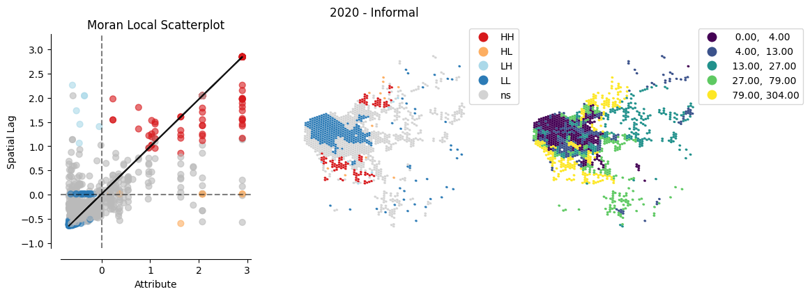

# `CENSAr` 
## Urban growth analysis tools

Combines vector and raster data to study the physical and qualitatuve growth of urban areas. 

**1. Imagery based indexes**

Use the [raster data analysis](https://github.com/CEEU-lab/CENSAr/tree/develop/CENSAr/raster_data_analysis) module to solve classification problems. 

*e.g.* **Urban Sprawl detection**

<p align="center">
  
</p>


**2. Spatial distributions**

Simulate [tracts distributions](https://github.com/CEEU-lab/CENSAr/tree/develop/CENSAr/spatial_distributions) based on vectorized census data (`2001`, `2010`, `2020`)

<p align="center">
  
</p>

<p align="center">
  
</p>
  

**3. Spatial features**

Instatiate city objects and evaluate their [spatial distribution of attributes](https://github.com/CEEU-lab/CENSAr/tree/develop/CENSAr/spatial_features)

*e.g.* **Spatial Dissimilitude**

<p align="center">
  
</p>


**4. Spatial autocorrelation**

Detect variable groups concentration with [clustering functionalities](https://github.com/CEEU-lab/CENSAr/tree/develop/CENSAr/clustering)

*e.g.* **Clusters detection**

<p align="center">
  
</p>

<p align="center">
  
</p>

## Installation

* Set up your python environment:

``` shell
> virtualenv myvenv --python=python3.10
> source myvenv/bin/activate
```

* Install the package

``` shell
> python setup.py install
> pip install -r requirements.txt
```

or 

* Install the package in develop mode for constributions

``` shell
> python setup.py develop
> pip install -r requirements-dev.txt
```

### Jupyter settings

* Add your venv to jupyter kernels

``` shell
> ipython kernel install --name=myvenv --user
```
